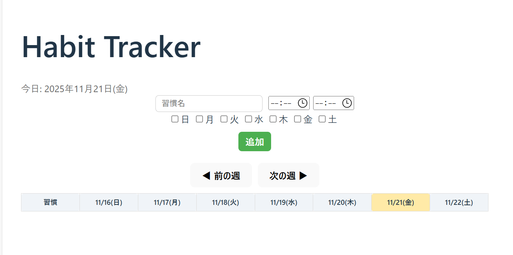
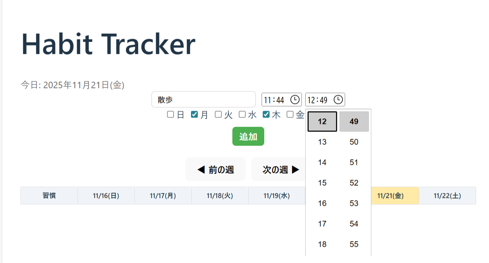
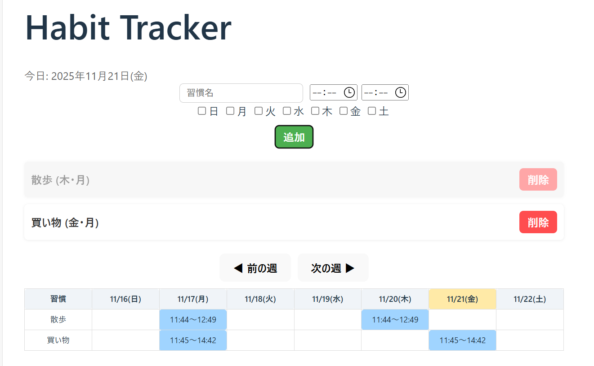
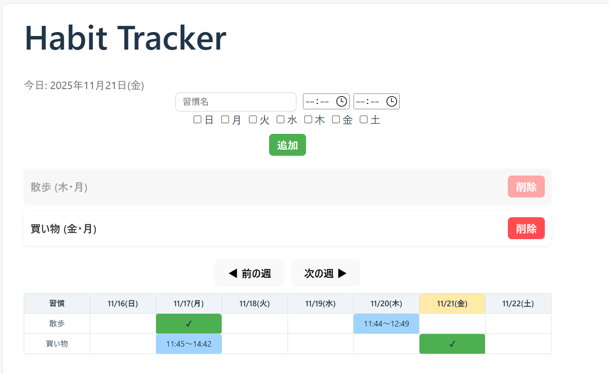

# Habit Tracker

GitHub Pages URL: https://yuta7979.github.io/habit-tracker/

---

## アプリの概要

「Habit Tracker」は、日々の習慣を管理できる React 製の Todo アプリです。  
習慣の名前、曜日、開始時間・終了時間を設定でき、カレンダー上で今日や指定した曜日の習慣を確認・管理できます。

---

## 主な機能

- **習慣の追加**
  - 習慣名、曜日、開始時間・終了時間を設定可能
- **カレンダー表示**
  - 習慣の設定された曜日が青色で表示され、時間も確認可能
  - 週単位で表示、チェックは手動で行える
  - 設定されていない曜日はチェック不可
- **本日の日付表示**
  - タイトル下に本日の日付と曜日を表示

---

## 画面例（スクリーンショット）

### 1. 習慣追加フォーム

### 2. カレンダー表示

### 3. 習慣設定例

### 4. 習慣設定例

---

## 開発で工夫した点

- カレンダーは **週単位で動的に生成**  
- 設定された曜日にだけ青色で表示することで、視覚的に分かりやすくした  
- 時間を設定するとカレンダーに表示され、習慣管理の精度を向上  
- チェックはカレンダー上でのみ可能にし、フォームのチェックは非表示に変更

---

## 技術スタック

- **フレームワーク:** React 19
- **ビルドツール:** Vite 7
- **言語:** TypeScript
- **スタイル:** CSS / Inline Style
- **デプロイ:** GitHub Pages
- **ESLint:** コード整形・チェック用

---

## 開発期間

開発期間: 2025.11.6 ~ 2025.11.19（約 23 時間）
